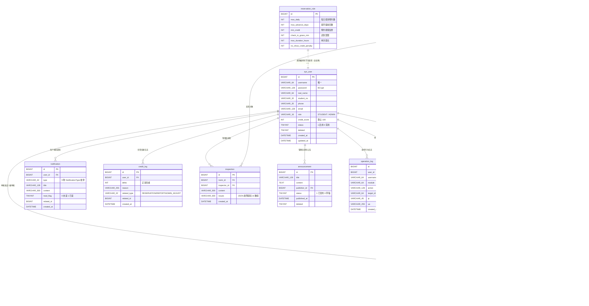

# Campus Study Hub —— 数据库 ER 图

> 12 张核心业务表。字符集 `utf8mb4` + collation `utf8mb4_unicode_ci`，全部表带 `id BIGINT AUTO_INCREMENT` + `created_at` + `updated_at`，业务主表带 `deleted TINYINT DEFAULT 0`（MP `@TableLogic` 软删）。
> 枚举字段在 DB 存字符串（`VARCHAR(16/32)`），Java 端绑业务枚举。

---

## 实体关系（mermaid）

---

## 关键索引

| 表 | 索引 | 用途 |
|---|---|---|
| `sys_user` | `uk_username` 唯一 | 登录查询 |
| `sys_user` | `idx_student_no` | 学号查找 |
| `seat` | `uk_room_seat (room_id, seat_no)` 唯一 | 同房间座位编号唯一 |
| `seat` | `idx_room_status (room_id, status)` | 房间可用座位筛选 |
| `reservation` | `idx_user_status (user_id, status)` | 我的预约 |
| `reservation` | `idx_seat_time (seat_id, start_time, end_time)` | 时段冲突检测 |
| `reservation` | `idx_room_time (room_id, start_time)` | 房间预约排程 |
| `report` | `idx_reporter / idx_target / idx_status` | 举报检索 |
| `credit_log` | `idx_user` | 用户信誉历史 |
| `notification` | `idx_user_read (user_id, read_flag)` | 未读消息查询 |
| `inspection` | `idx_room` | 房间巡检历史 |
| `seat_fault` | `idx_seat / idx_status` | 故障检索 |
| `operation_log` | `idx_module / idx_created` | 日志按模块/时间查 |

---

## 软删字段

下列表使用 `deleted TINYINT DEFAULT 0`（MyBatis-Plus `@TableLogic` 自动逻辑删除）：

`sys_user` · `study_room` · `seat` · `reservation` · `report` · `announcement`

`credit_log` / `notification` / `inspection` / `operation_log` / `seat_fault` 不软删（按业务追加式写入，无更新需求或物理记录）；
`reservation_rule` 全局唯一单行配置，不删除。

---

## 状态枚举速查

| 枚举 | 值 | 字段 |
|---|---|---|
| `Role` | STUDENT / ADMIN | `sys_user.role` |
| `SeatStatus` | AVAILABLE / RESERVED / OCCUPIED / FAULT | `seat.status` |
| `ReservationStatus` | BOOKED / CHECKED_IN / COMPLETED / CANCELLED / EXPIRED | `reservation.status` |
| `ReportStatus` | PENDING / RESOLVED / REJECTED | `report.status` |
| `NotificationType` | RESERVATION_CREATED/CANCELLED/EXPIRED/REMINDER · REPORT_FILED/RESOLVED · CREDIT_CHANGED · ANNOUNCEMENT · SYSTEM | `notification.type` |
